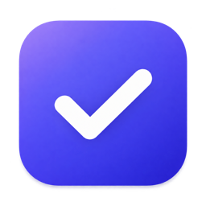
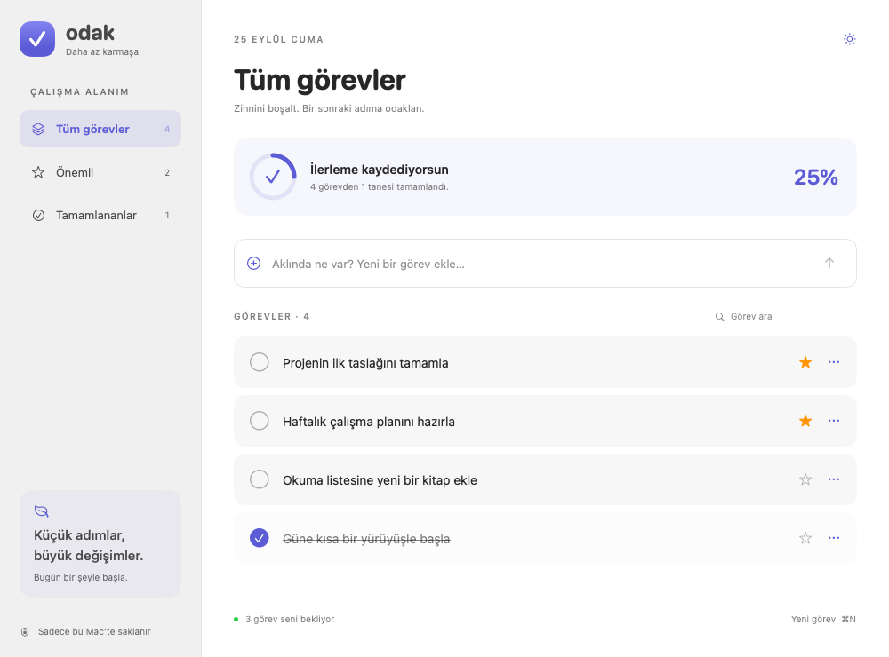
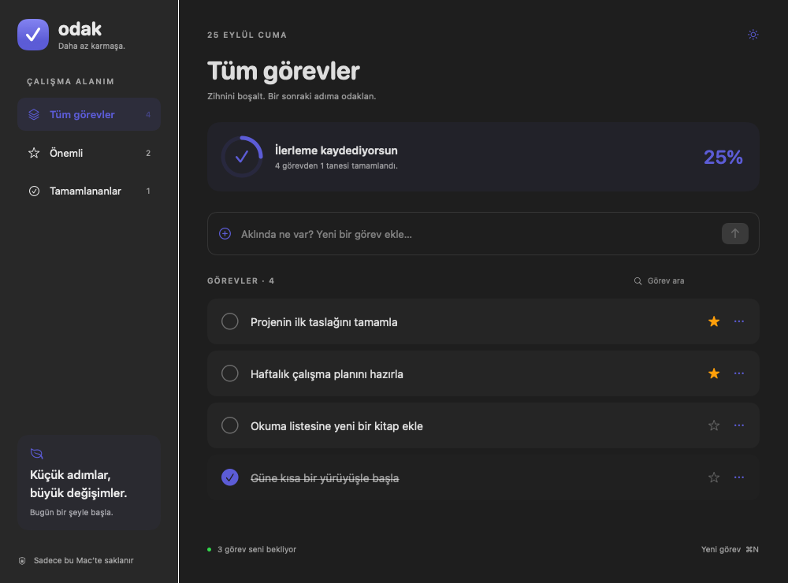

<p align="center">
  
</p>

<h1 align="center">Odak</h1>

<p align="center">
  <strong>Daha az karmaşa. Daha fazla odak.</strong><br>
  SwiftUI ile geliştirilmiş, Türkçe arayüzlü bir macOS yapılacaklar uygulaması.
</p>

<p align="center">macOS 14+ · Swift · SwiftUI · Yerel JSON depolama</p>

Odak, günlük işlerini tek bir yerde toplamana, önemli görevlerini öne çıkarmana ve ilerlemeni takip etmene yardımcı olur. Hesap oluşturmayı gerektirmez; görevlerin yalnızca Mac’inde saklanır.

> Depo ve Xcode hedefi `ios_test` adını taşısa da uygulama **macOS** için geliştirilmiştir.

## Ekran görüntüleri

### Açık görünüm



### Koyu görünüm



*Görseller, projenin SwiftUI arayüzünden örnek görevlerle oluşturulmuştur.*

## Özellikler

- **Görev yönetimi:** Görev ekle, başlığını düzenle, tamamla veya sil.
- **Önemli görevler:** Yıldızla işaretlediğin, henüz tamamlanmamış işleri ayrı bir listede gör.
- **Filtreleme ve arama:** Tüm görevler, önemli görevler ve tamamlananlar arasında geçiş yap; seçili listede başlığa göre ara.
- **İlerleme takibi:** Tüm görevlerin tamamlanma oranını ve kalan görev sayısını takip et.
- **Sistemle uyumlu görünüm:** Açık ve koyu tema desteğiyle çalış.
- **Yerel saklama:** Görevlerini uygulamayı kapatıp açtığında koru; bulut veya hesap kurulumu gerekmez.

## Kurulum ve çalıştırma

### Gereksinimler

- macOS 14 Sonoma veya üzeri
- Swift Testing desteği içeren Xcode 16 veya üzeri

Tam Xcode uygulaması gereklidir; yalnızca Command Line Tools, Xcode projesini açmak ve test paketlerini çalıştırmak için yeterli değildir.

1. Depoyu klonla veya ZIP olarak indir.
2. `ios_test.xcodeproj` dosyasını Xcode ile aç.
3. Şema olarak **ios_test**, çalıştırma hedefi olarak **My Mac** seç.
4. **⌘R** ile uygulamayı çalıştır.

Ek bir üçüncü taraf bağımlılık kurulumu gerekmez. Arayüz önizlemesini görmek için `ContentView.swift` dosyasını açıp **Editor → Canvas** seçeneğini kullanabilirsin.

## Kullanım

| İşlem | Nasıl yapılır? |
| --- | --- |
| Görev ekle | “Aklında ne var?” alanına yaz ve **Return** tuşuna veya ok düğmesine bas. |
| Yeni görev alanına geç | **⌘N** kısayolunu kullan. |
| Tamamla veya yeniden aç | Görev başlığının yanındaki daireye tıkla. |
| Önemli olarak işaretle | Görevin yanındaki yıldız düğmesine tıkla. |
| Düzenle veya sil | Görevin **…** menüsünü aç. |
| Görev ara | “Görev ara” alanına başlıktan bir kelime yaz. |

**Önemli** listesindeyken eklediğin görevler otomatik olarak önemli işaretlenir. Tamamlanan görevler **Tüm görevler** listesinde sona taşınır; **Tamamlananlar** filtresinden ayrıca görüntülenebilir. İlerleme göstergesi, seçili filtreden bağımsız olarak tüm görevleri esas alır.

## Veri saklama

Görevler `Codable` ile JSON biçiminde aşağıdaki dosyaya kaydedilir:

```text
~/Library/Application Support/Odak/tasks.json
```

Kayıtlar atomik olarak yazılır. Bir değişiklik ancak dosyaya başarıyla kaydedildikten sonra uygulamanın görev listesine yansır. Kayıt dosyası okunamazsa mevcut verilerin üzerine yazılmasını önlemek için görev değişiklikleri engellenir ve arayüzde hata mesajı gösterilir.

Uygulamada bulut senkronizasyonu yoktur. Yedek almak için uygulamayı kapattıktan sonra `tasks.json` dosyasının bir kopyasını saklayabilirsin.

## Proje yapısı

Projeyi kod üzerinden öğrenmek için [Satır Satır Geliştirici Rehberi (PDF)](docs/odak-gelistirici-rehberi.pdf) belgesini inceleyebilirsin. Rehber; altı Swift dosyasındaki 514 satırı, SwiftUI yerleşimlerini, veri akışını ve testleri açıklamalarıyla ele alır. [Markdown sürümü](docs/odak-gelistirici-rehberi.md) de mevcuttur.

```text
ios_test/
├── ios_testApp.swift       # Uygulama başlangıcı ve pencere yapılandırması
├── ContentView.swift       # Görev listesi, filtreler, arama ve düzenleme arayüzü
├── TaskStore.swift         # Görev modeli, işlemler ve JSON depolama
└── Assets.xcassets/        # Uygulama simgesi ve görsel kaynaklar
ios_testTests/             # Swift Testing ile model ve depolama testleri
ios_testUITests/           # XCTest ile açılış ve performans testleri
docs/screenshots/          # README görselleri
```

`TaskStore`, görev verisini `@MainActor` üzerinde yönetir ve `ObservableObject` aracılığıyla arayüze sunar. `ContentView`, bu veriyi `@EnvironmentObject` üzerinden kullanır.

## Testler

Xcode’da **⌘U** ile testleri çalıştırabilirsin. Terminalden çalıştırmak için aktif geliştirici dizininin tam Xcode kurulumunu göstermesi gerekir:

```sh
xcodebuild test \
  -project ios_test.xcodeproj \
  -scheme ios_test \
  -destination 'platform=macOS'
```

Model testleri şu davranışları doğrular:

- Boş görevlerin reddedilmesi ve başlıkların çevresindeki boşlukların temizlenmesi
- Görevlerin ve önemli işaretinin diskten yeniden yüklenmesi
- Düzenleme, tamamlama ve silme işlemlerinin kalıcı olması
- Bozuk kayıt dosyasının üzerine yazılmaması

UI testleri uygulamanın açılışını ve açılış performansını kapsar; tüm kullanıcı etkileşimlerini doğrulayan bir uçtan uca test paketi değildir.
